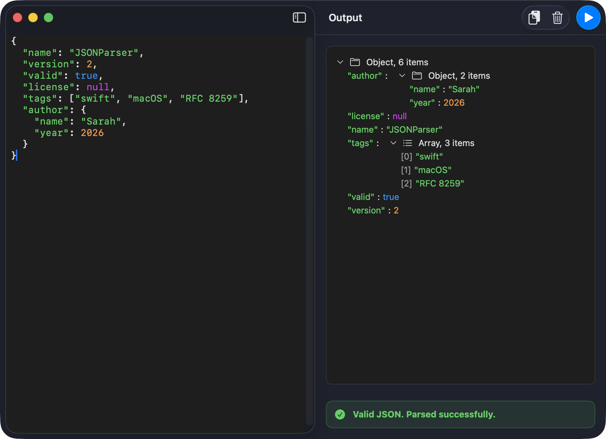
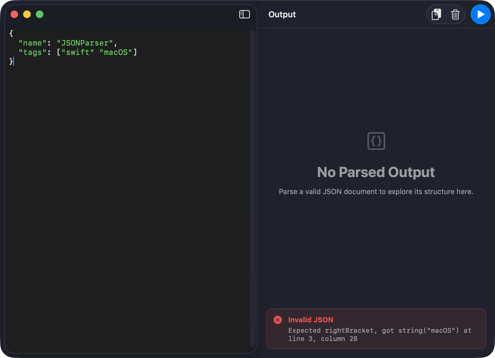
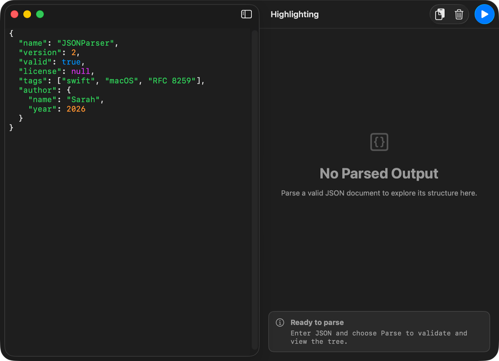

<div align="center">
  
  <h1 style="display: inline-block; vertical-align: middle;">JSONParser</h1>
</div>

[](https://github.com/OGSarah/JSONParser/actions/workflows/swiftlint.yml)
[](https://github.com/OGSarah/JSONParser/actions/workflows/tests.yml)

A native macOS app built with SwiftUI that validates and explores JSON using a hand written parser. It implements the RFC 8259 grammar with a custom lexer and recursive descent parser, with no use of `Foundation`'s `JSONSerialization`. Paste or type JSON, parse it, and browse the result as a collapsible tree with precise, line and column aware error reporting.


## Architecture

The app follows a layered, testable design. Views own no business logic; all screen state lives in an `@Observable` view model that depends only on protocols, so each layer is replaceable and unit testable in isolation. The lexer and parser are pure, `nonisolated` value and reference types with no UI dependencies.

```
App/         JSONParserApp (@main); injects a hermetic view model under UI test
Models/      JSONNode, Token, Position, ValidationResult (+ ParseError with line/column)
Services/    JSONParsing  -> JSONParser  (lexer + recursive descent parser)
             Lexer, Parser (RFC 8259), PasteboardReading -> SystemPasteboard
ViewModels/  ParserViewModel (@Observable, @MainActor)
Views/       ContentView (NavigationSplitView shell)
  Components/  SyntaxTextView, OutputTreeView, JSONNodeView, ResultBanner
Support/     AccessibilityIdentifiers, UITestSupport (DEBUG only)
```

**Key decisions**

| Decision | Why |
|:---|:---|
| `@Observable` view model, no Combine | Modern Swift state; one view model owns all screen state and is tested through mocks. |
| `JSONParsing` protocol seam | The view model depends on an abstraction, so tests inject a stub and never run the real parser. |
| `PasteboardReading` protocol | Paste behavior is unit tested without touching `NSPasteboard`. |
| Typed `ParseError` with line and column | Call sites and tests read the exact location of a failure rather than parsing a string. |
| `nonisolated` lexer and parser | Pure parsing logic is thread agnostic and free of the project wide default `@MainActor` isolation. |
| Hermetic UI tests via launch arguments | A DEBUG `StubJSONParser` makes UI flows deterministic and independent of the real parser. |
| Synchronized Xcode folder groups | The folder layout above is the project structure, so files move without editing `project.pbxproj`. |


## Features

- **Validate**: parse pasted or typed JSON and see a clear valid or invalid result.
- **Explore**: browse valid documents as an indented, collapsible tree of objects, arrays, and scalars.
- **Precise errors**: invalid input surfaces a typed error with its line and column.
- **Syntax highlighting**: the editor colorizes strings, numbers, booleans, null, and punctuation as you type.
- **Full JSON support**: objects, arrays, strings with escapes and `\uXXXX`, numbers with fractions and exponents, booleans, and null.
- **Keyboard first**: Parse (Return), Paste (Command V), and Clear (Command K).
- **Accessibility built in**: VoiceOver labels, traits, and hints throughout, plus stable identifiers backing the UI tests.


## Accessibility

The app is built to work with VoiceOver from the start:

- Every control has a spoken label and hint. Parse, Paste, and Clear each describe what they do.
- The result banner reads as a single element, announcing either "Valid JSON. Parsed successfully." or "Invalid JSON." followed by the specific error.
- Tree rows for scalar values combine into one element, so VoiceOver reads "key, value" in a single swipe, while container rows stay navigable and expose the Header and Button traits with an expanded or collapsed value.
- Decorative glyphs (chevrons, folder and list icons, the banner icon) are hidden from VoiceOver to cut announcement noise.
- Stable accessibility identifiers back the UI test suite, so a renamed identifier breaks the tests rather than silently regressing.


## Screenshots

Here are some screenshots showcasing the app's features in dark mode:

| Validate & explore |
| :---: |
|  |
| **Precise errors** |
|  |
| **Syntax highlighting** |
|  |


## Language, Frameworks, and Tools

- Swift with strict, approachable concurrency and default `@MainActor` isolation
- SwiftUI and Observation (`@Observable`)
- AppKit interop (`NSTextView`) for the syntax highlighted editor
- macOS 26 / Xcode 26
- Swift Testing (logic and view model) plus XCTest and XCUIAutomation (UI)
- SwiftLint
- GitHub Actions (CI)


## Testing

The protocol seams make the business logic testable without the UI. Pure logic suites use **Swift Testing** (`@Suite` / `@Test` / `#expect`); UI flows use **XCUIAutomation**, since Swift Testing cannot drive UI automation.

| Suite | Layer | Coverage |
|:---|:---|:---|
| `LexerTests` | Lexer | Structural tokens, string escapes including `\uXXXX`, number forms, and errors with line and column. |
| `ParserTests` | Parser | Empty, nested, and mixed structures; trailing commas, missing colons, non string keys, and unclosed containers. |
| `JSONParserFacadeTests` | Facade | End to end valid and invalid documents, trailing data rejection, and outcome equality. |
| `JSONNodeTests` | Model | Deep equality, key order independence, and the leaf classification. |
| `ValidationResultTests` | Model | `ValidationResult` and `ParseError` equality, including line and column. |
| `PositionTests` | Model | Column advance and newline tracking. |
| `ParserViewModelTests` | View model | Valid and invalid paths, pane switching, paste, clear, and derived state, against a mock parser and pasteboard. |
| `JSONParserUITests` | UI | Launch, parse valid and invalid, clear, paste, and identifier presence; hermetic via the `-uiTest` launch arguments. |


## Continuous Integration

Every push and pull request to `main` runs two independent [GitHub Actions](.github/workflows) workflows on a `macos-26` runner with the latest stable Xcode 26. The status badges at the top of this file reflect the most recent run on `main`.

| Workflow | What it does |
|:---|:---|
| [`tests.yml`](.github/workflows/tests.yml) | Builds the app and runs the `JSONParserTests` logic suite via `xcodebuild test` against the `platform=macOS` destination, then uploads the `.xcresult` bundle as an artifact for inspection. |
| [`swiftlint.yml`](.github/workflows/swiftlint.yml) | Lints the full source tree with SwiftLint in `--strict` mode, so any warning fails the build and surfaces inline through `github-actions-logging`. |

**Pipeline decisions**

| Decision | Why |
|:---|:---|
| `--strict` SwiftLint as a required check | Style and lint warnings are treated as errors, so the `main` branch stays warning clean rather than accumulating drift. |
| `concurrency` with `cancel-in-progress` | A new push to a branch cancels its superseded runs, saving runner minutes and giving faster feedback on the latest commit. |
| `CODE_SIGNING_ALLOWED=NO` | CI builds and tests without a signing identity, so the pipeline needs no secrets and runs identically for forks and pull requests. |
| `EXCLUDED_SOURCE_FILE_NAMES='*.icon'` | The Icon Composer `AppIcon.icon` is authored by a newer toolchain than the runner's `actool`, which crashes compiling it; excluding it lets the legacy `.appiconset` provide the icon while the build stays green. |
| Always-upload `.xcresult` artifact | Test results are retained even on failure, so a red run can be downloaded and opened in Xcode to triage without re-running locally. |
| Pinned `macos-26` / latest-stable Xcode | The runner image matches the project's macOS 26 / Xcode 26 target, so CI compiles against the same SDK and concurrency model as local development. |


## License

Released under the [MIT License](LICENSE). © 2026 SarahUniverse
